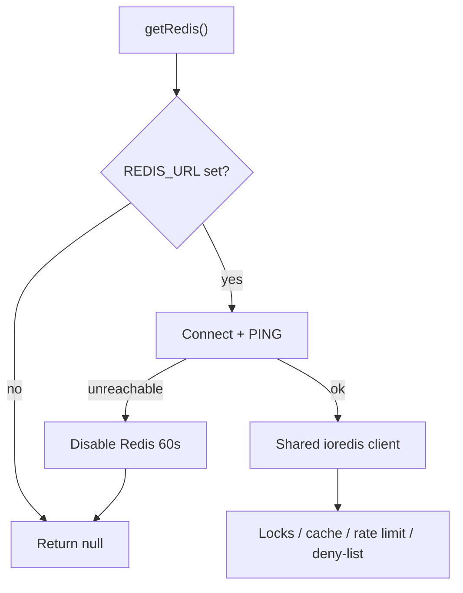

The app is a Next.js deployment on Vercel. MongoDB is the source of truth for users and plans. **Redis** (`REDIS_URL`, ioredis) coordinates state that cannot live in a single serverless isolate: step locks, editor presence, short-lived caches, rate limits, and logout token deny-list.

Without Redis, those features fall back to an **in-process `Map`**. That is fine on one `next dev` process. On Vercel it is not: each function instance has its own memory, so two principals can edit the same step without seeing each other’s lock.

<CardGroup cols={2}>
  <Card title="System health" icon="heart-pulse" href="/features/system">
    Super Admin snapshot of Redis memory, key counts, and flush/retry actions.
  </Card>
  <Card title="Collaboration locks" icon="lock" href="/features/collaboration">
    How a step lock is acquired, refreshed, and released from the form workspace.
  </Card>
</CardGroup>

## Keyspace

| Prefix | Purpose | TTL | Flush from System? |
| --- | --- | --- | --- |
| `qb:published:{year}:{version}` | Published question bank payload | 300s | Yes |
| `year:{YYYY-YYYY}` | `SchoolYearSettings` document | 120s | Yes |
| `public:overview:{year}` | Unauthenticated homepage snapshot | 60s | Yes |
| `form:{formId}:step:{stepKey}` | Exclusive step lock | 300s | **No** |
| `form:{formId}:editor:{userId}:{stepKey}` | Presence heartbeat | 60s | **No** |
| `rl:*` | Sliding-window counters | window (usually 60s) | **No** |
| `sess:deny:{jti}` | Logged-out JWT id | remaining session life (min 60s, default 8h) | **No** |

`POST /api/admin/health` `{ "action": "flush-cache" }` deletes only `qb:published:*`, `year:*`, and `public:overview:*`. It never `FLUSHALL`s and never drops locks, presence, rate-limit, or deny-list keys.

## Fail-open vs fail-closed

If Redis is unreachable, the client backs off for 60 seconds (`retry-redis` on System clears that timer). Behavior then depends on the caller:

| Feature | No Redis / Redis down |
| --- | --- |
| Question bank, year settings, public overview | Cache miss → read MongoDB or JSON |
| Step locks and editor presence | In-memory `Map` (not shared across instances) |
| Step save rate limit | **Fail-open** locally (`ok: true`) |
| Auth POST, user mutations, form create (production) | **Fail-closed** → `429` with `Retry-After` |
| Logout deny-list | Skip write/read; JWT stays valid until expiry |

Production fail-closed is `VERCEL_ENV === 'production'` or `NODE_ENV === 'production'` (`src/lib/userAccess.js`).

## Connection

`src/lib/mongodb.js` caches the Mongoose connection on `global.mongoose` and a MongoClient promise for NextAuth. Restart `npm run dev` after schema changes so the model is not stale in that cache.

`src/lib/redis.js` keeps one ioredis client on `global.__d79Redis` (`maxRetriesPerRequest: 1`, lazy connect). `ioredis` is a Next.js `serverExternalPackages` entry so it is not bundled by webpack/Turbopack.

<Callout type="warning">
  Set `REDIS_URL` in every Vercel environment that serves more than one instance. Super Admin System health shows whether Redis is configured, healthy, or backing off — never the password.
</Callout>
