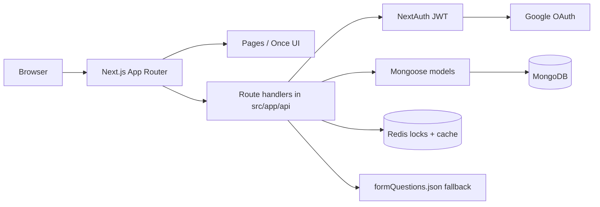

{/* Screenshot needed: System architecture — Add diagram showing browser → Next.js App Router → NextAuth/Google → API routes → Mongoose → MongoDB, with optional Redis for step locks, cache, and save rate limits. */}

## Runtime

## Application surfaces

| Path | Audience | Notes |
| --- | --- | --- |
| `/`, `/about` | Public | Once UI portal shell (`PublicShell`) |
| `/login` | Public | Google sign-in |
| `/unavailable` | Public | Shown when `GEO_RESTRICT=deny` blocks an out-of-state HTML request |
| `/dashboard` | Authenticated | Workspace; `?view=` switches comments, analytics, bulk, year setup |
| `/form/new` | Level 4+ | Create a blank plan for the current (unarchived) year |
| `/form/[id]` | Assigned users | Multi-step editor (`FormWorkspace`) |
| `/form/[id]/compare` | Assigned users | Attendance, housing, counseling vs prior year |
| `/view/[id]` | Authenticated with access | Read-only viewer |
| `/admin/submissions` | Super Admin | District submissions + year-scoped export |
| `/admin/users` | Level 4–5 | School users (4) or all users (5) |
| `/admin/schools` | Super Admin | Create, rename, and deactivate schools |
| `/admin/questions` | Super Admin | Draft / publish question bank |
| `/admin/goals` | Super Admin | Goals clustered by school year |
| `/admin/system` | Super Admin | API, MongoDB, and Redis health |
| `/admin/logs` | Super Admin | Audit log UI |

## Important libraries

| Module | Responsibility |
| --- | --- |
| `src/lib/mongodb.js` | Cached Mongoose connection + MongoClient promise |
| `src/lib/auth.js` | NextAuth options (JWT 8h, impersonation, `jti` deny-list) |
| `src/proxy.js` | Next.js 16 edge gate (session, admin level, auth rate limit) |
| `src/lib/schoolYear.js` | `currentSchoolYear` (JS month ≥ 6 → July start of `YYYY-YYYY`) |
| `src/lib/formDuplicate.js` | Clone answers, stamp `duplicatedFrom`, `needsUpdate` |
| `src/lib/questionBank.js` | Published / draft `FormTemplate`, JSON fallback |
| `src/lib/schoolYearSettings.js` | Archive lock, deadlines, district goals, compare steps |
| `src/lib/formSteps.js` | Step key ↔ number mapping |
| `src/lib/locking.js` | Redis or in-memory step locks (TTL 300s) |
| `src/lib/redis.js` | Shared Redis client, cache, SCAN, save rate limit |
| `src/lib/systemHealth.js` | Super Admin health snapshot (API / Mongo / Redis) |
| `src/lib/formAccess.js` | `canViewForm` / `canEditForm` (same-school levels 2–4) |
| `src/lib/schools.js` | Super Admin school catalog (create / rename / deactivate) |
| `src/lib/auditLogger.js` | Writes `AuditLog` rows |
| `src/lib/geoRestrict.js` | NY-state geo headers; `GEO_RESTRICT=deny` |

## UI layering

Authenticated chrome uses Once UI under `.once-ui-root` (`DashboardShell`). Public pages use the same Once UI providers from `src/app/providers.js`. Tailwind utility classes on Once UI pages can fight Once UI spacing; keep new product UI inside `.once-ui-root`.

See also [Caching and Redis](/architecture/caching) and [Edge proxy and security](/architecture/security).
