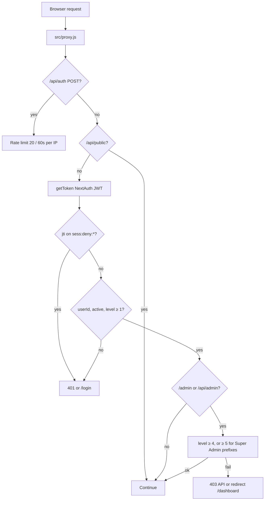

Next.js 16 renamed middleware to **proxy**. The file is `src/proxy.js` (not `middleware.js`). It runs on the edge matcher below **before** App Router pages and route handlers.

```js
export const config = {
  matcher: [
    '/',
    '/about',
    '/login',
    '/unavailable',
    '/dashboard',
    '/dashboard/:path*',
    '/form/:path*',
    '/view/:path*',
    '/admin/:path*',
    '/api/:path*',
  ],
};
```

Public HTML (`/`, `/about`, `/login`) **is** in the matcher so a New York geo deny can cover them, but those paths skip the session redirect (otherwise `/login` would loop). `/unavailable` is also in the matcher so the proxy can let it through after a geo deny; it skips both the geo redirect and the session gate. `GET /api/public/*` returns immediately without a session.

## Request path



<AccordionGroup>
  <Accordion title="Super Admin page prefixes (level 5)">
    `/admin/questions`, `/admin/logs`, `/admin/system`, `/admin/goals`, `/admin/submissions`
  </Accordion>
  <Accordion title="Super Admin API prefixes (level 5)">
    `/api/admin/questions`, `/api/admin/health`, `/api/admin/goals`, `/api/admin/forms/rollover`, `/api/admin/forms/live`, `/api/admin/forms/export`
  </Accordion>
  <Accordion title="School admin (level ≥ 4)">
    Other `/admin/*` and `/api/admin/*` paths (for example `/admin/users` and `/api/admin/users/school`) require a principal or Super Admin JWT. Route handlers still reload `User` from MongoDB for the real permission check.
  </Accordion>
</AccordionGroup>

The proxy is a **coarse gate**. Form-level RBAC (owner, same school, assignment, share) lives in `src/lib/formAccess.js` and each route handler. See [Roles and access](/features/roles).

## New York geo restriction

Vercel sets `x-vercel-ip-country` and `x-vercel-ip-country-region` on requests that hit their network. The proxy reads those in `src/lib/geoRestrict.js`.

- Allowed: **US** + region **NY** (New York State). Do **not** match `geo_city` to `"New York"` — Brooklyn, Queens, the Bronx, and Staten Island IPs usually geolocate to the borough name and would be locked out.
- Missing headers (local `next start`) are treated as allowed.
- App enforcement is off unless `GEO_RESTRICT=deny`. WAF log/challenge rules sit in front of the process; the proxy only hard-denies.
- HTML denials redirect to **`/unavailable`** (branded page, no API calls). API denials stay **403 JSON**.

See [Environment variables](/deploy/environment).

## JWT deny-list

Every JWT gets a `jti` (UUID). On `signOut`, NextAuth writes `sess:deny:{jti}` in Redis until the token would have expired. Proxy and the JWT callback treat a denied `jti` as unauthenticated.

Without Redis, logout cannot revoke the cookie early. The session still expires at `maxAge` (8 hours).

## HTTP headers

`next.config.js` sets these on `/:path*`:

| Header | Value |
| --- | --- |
| `X-Frame-Options` | `DENY` |
| `X-Content-Type-Options` | `nosniff` |
| `Referrer-Policy` | `strict-origin-when-cross-origin` |
| `Permissions-Policy` | `camera=(), microphone=(), geolocation=()` |
| `Strict-Transport-Security` | `max-age=63072000; includeSubDomains; preload` |
| `Content-Security-Policy` | `'self'` default; Google accounts for OAuth; Vercel Analytics/Insights scripts and connect |

CSP `script-src` includes `'unsafe-inline'` (Next.js / Once UI). `'unsafe-eval'` was removed. Do not loosen `frame-ancestors` or `form-action`.

## Indexing

| Surface | Indexing |
| --- | --- |
| `/`, `/about` | Allowed in `src/app/robots.js`; listed in `src/app/sitemap.js` |
| `/dashboard`, `/admin`, `/form`, `/view`, `/login`, `/api`, `/unavailable` | `disallow` in robots.txt |
| Authenticated layouts | `src/lib/privateRobots.js` sets `robots: noindex, nofollow` on HTML |

`metadataBase` follows `NEXTAUTH_URL`.

## OAuth hardening

Google provider in `src/lib/auth.js`:

- `hd: 'schools.nyc.gov'` so the account picker prefers DOE Workspace
- `prompt: 'select_account'`
- `checks: ['pkce', 'state', 'nonce']`
- Secure cookies when `NEXTAUTH_URL` is `https://`

Sign-in still **requires** a pre-registered, active `User` with that email. `hd` is not a substitute for the MongoDB allowlist.
