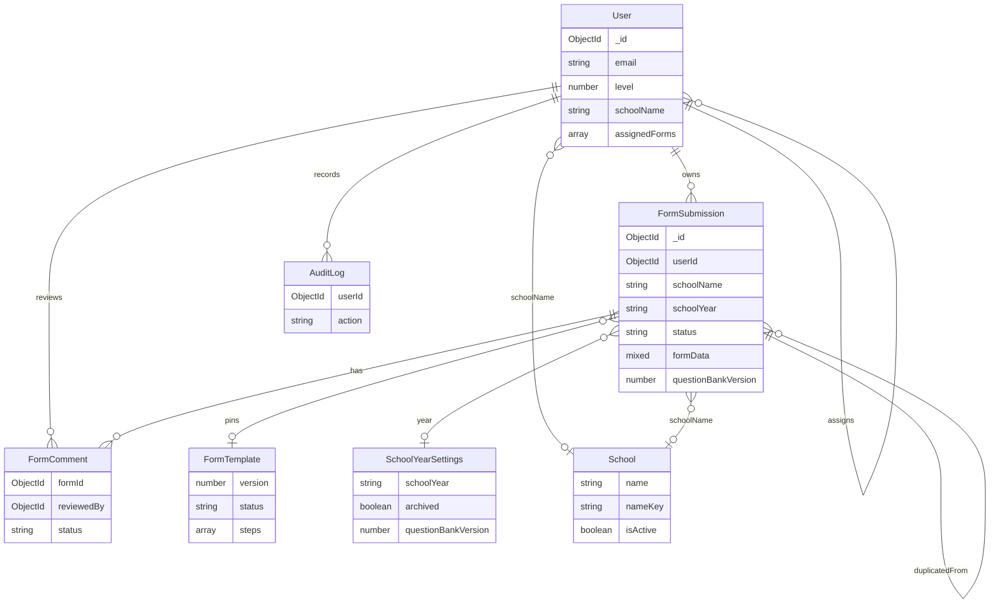

MongoDB database name comes from `MONGODB_URI` (typically `d79-directory`). Collections are Mongoose models in `src/models`. Field-level tables live on [Database models](/database/models).



## Ownership vs collaboration

A plan has **one owner** (`FormSubmission.userId`) and a **principal of record** (`principalEmail` / `principalName`). Those are often the same person. Super Admin can transfer ownership; the previous owner is appended to `transferHistory[]`.

Collaboration is **not** a join collection. It is stored in two places:

| Mechanism | Where | Typical actor |
| --- | --- | --- |
| Assignment | `User.assignedForms[]` on the collaborator | Principal share UI (`POST /api/admin/forms/share`) |
| Email share | `FormSubmission.sharedWithEmails[]` | Super Admin (`POST /api/forms/[id]/share`) |

Assistant Principals (level 3) need one of those records to **edit**. Same-school is not enough. See [Roles and access](/features/roles).

## Year and question bank pins

```text
SchoolYearSettings.schoolYear  ── unique ──► "2026-2027"
        │
        ├── archived            → all plans for that year read-only
        ├── questionBankVersion → default pin for new plans
        └── deadlines / districtGoals

FormSubmission.schoolYear
FormSubmission.questionBankVersion  → exact FormTemplate.version used when answering
FormSubmission.allowEditsWhenArchived → Super Admin one-plan override
```

Existing answers stay keyed by `formData[stepKey].data[question.id]`. Publishing a new bank does **not** rewrite old `formData`.

## Comments and audit

- `FormComment.formId` → `FormSubmission`. Optional `stepKey` / `stepNumber`. General comments (no step) can move form `status` to `under_review` / `approved` / `rejected`.
- `AuditLog` is append-only. Many user mutations also push onto `User.activityLog[]`.
- Indexes of note: `users.email` unique; `schools.nameKey` unique; `formsubmissions` partial unique `{ schoolName, schoolYear }` as `schoolName_schoolYear_unique`; `formtemplates.version` unique; `schoolyearsettings.schoolYear` unique.

<Callout type="tip">
  Super Admin System health reports whether `schoolName_schoolYear_unique` exists. Create and duplicate routes return `409` when a school already has a plan for that year.
</Callout>
